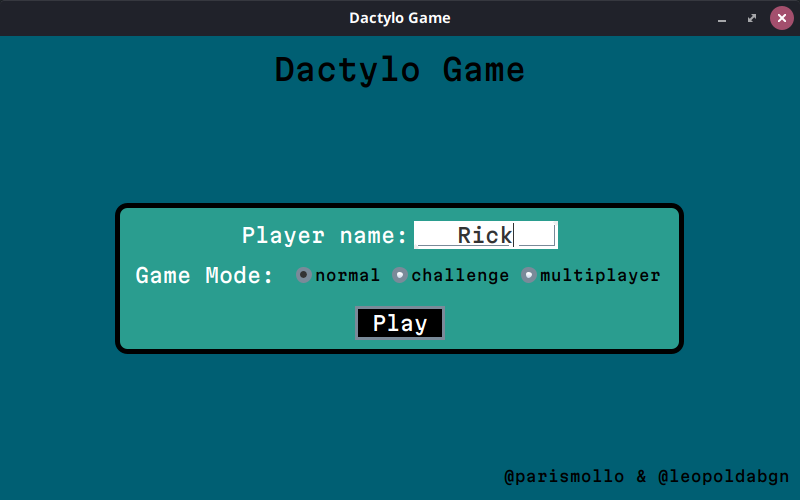
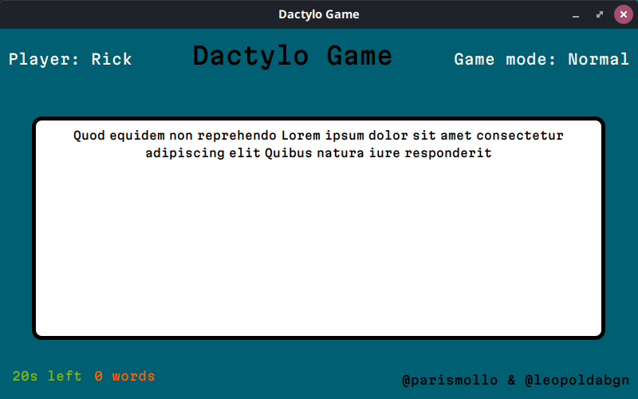
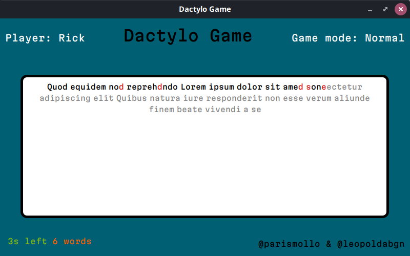
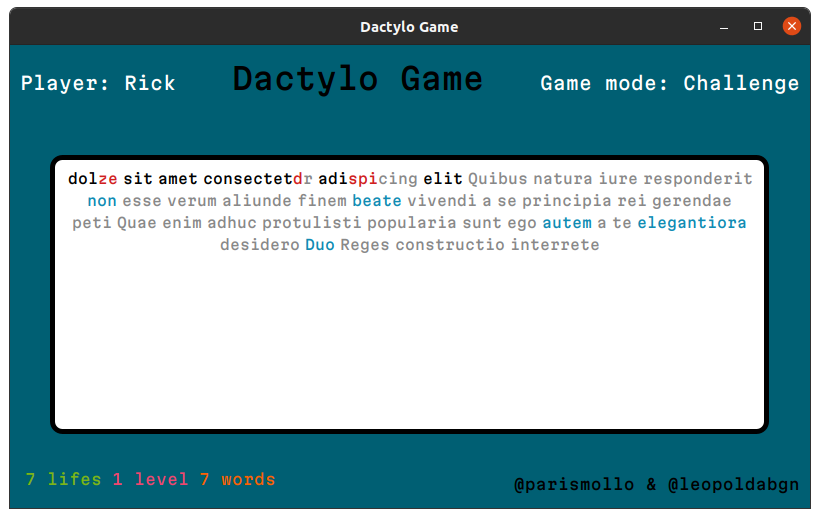
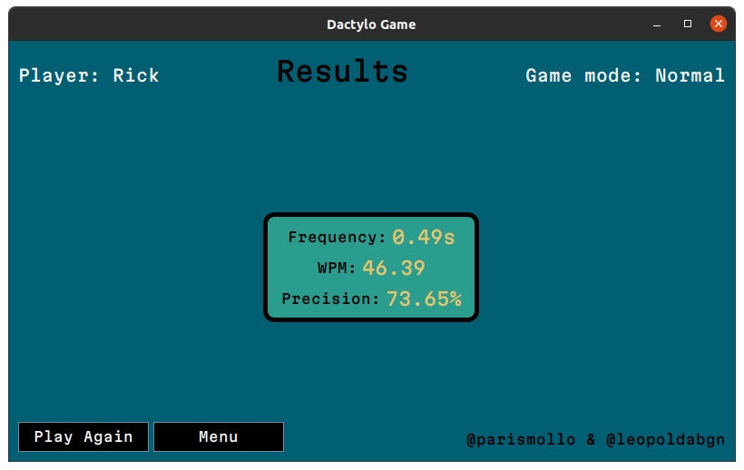
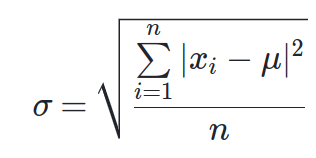

# Dactylo-game

<!-- Table des matières -->
- [Dactylo-game](#dactylo-game)
  - [Equipe](#equipe)
  - [Description du jeu](#description-du-jeu)
  - [Lancement du jeu](#lancement-du-jeu)
  - [Compilation / Execution](#compilation--execution)
  - [Tests](#tests)
  - [Utilisation](#utilisation)
    - [Page d'Accueil (HomeView)](#page-daccueil-homeview)
    - [Normal Mode](#normal-mode)
    - [Challenge Mode](#challenge-mode)
    - [Multiplayer Mode](#multiplayer-mode)
    - [Fin de partie (Stats)](#fin-de-partie-stats)
  - [Implémentation](#implémentation)
    - [Model](#model)
      - [Game](#game)
      - [Construction d'un Game (GameFactory)](#construction-dun-game-gamefactory)
      - [GameType](#gametype)
      - [ChallengeGame](#challengegame)
      - [NormalGame](#normalgame)
      - [Infos](#infos)
      - [Stats](#stats)
      - [Creation de la liste des caractères utiles](#creation-de-la-liste-des-caractères-utiles)
      - [WordQueue](#wordqueue)
      - [Word](#word)
    - [View](#view)
      - [Window](#window)
      - [HomeView](#homeview)
      - [GameView](#gameview)
      - [WordView](#wordview)
      - [StatsView](#statsview)
    - [Remarques diverses](#remarques-diverses)

<br/><br/><br/><br/><br/><br/><br/><br/><br/><br/>

## Equipe
* Léopold Abignoli
* Paris Mollo

## Description du jeu
Dactylo Game est un jeu de vitesse et de précision qui mettra votre capacité à taper au clavier à l'épreuve. Avec deux modes de jeu différents, vous pouvez choisir entre un défi contre la montre ou un mode où chaque erreur vous coûte une vie. Plus vous montez de niveaux, plus la vitesse augmente et plus les mots s'ajoutent rapidement. Mettez vos compétences de dactylographie à l'épreuve et devenez le roi du clavier dans Dactylo Game !

## Lancement du jeu
Vous pouvez lancer le projet en executant une des deux commandes suivantes:
```java
> ./run.sh
/* Sinon vous pouvez utiliser cette commande */
> java -jar dactylo-game.jar
```

## Compilation / Execution
Il s'agit d'un projet maven. Il vous faudra donc avoir installé maven au préalable sur votre machine. Pour l'installer vous pouvez suivre les instructions décrites ici:
- https://maven.apache.org/download.cgi
- https://maven.apache.org/install.html

Vous pouvez ensuite compiler le projet avec la commande suivante:
```bash
mvn package
```
Après compilation, le jar du projet se situe dans le dossier **target**. Pour le lancer, vous pouvez executer la commande suivante:
```bash
java -jar target/dactylo-game*.jar
```
Pour compiler et executer le projet plus facilement, vous pouvez lancer le fichier `compile_and_run.sh`. Il compile puis execute le projet :
```bash
./run.sh
```

## Tests
Plusieurs fichiers de tests sont présents dans le projet. Ils sont situés dans le dossier `src/test`. Pour lancer les tests, vous pouvez executer le commande suivante:
```bash
mvn test
```

## Utilisation
Après avoir lancé le programme, vous devriez arriver sur la page d'accueil, défini par la classe `HomeView.java`.

### Page d'Accueil (HomeView)
________________________________________________

La page d'accueil est assez simple à comprendre. Au centre de la page, plusieurs informations concernant le lancement de votre partie sont présent. Vous devez notamment renseigner votre :
- nom d'utilisateur
- mode de jeu (NORMAL, CHALLENGE, MULTIPLAYER)

Enfin, vous n'avez plus qu'à cliquer sur **Play** pour lancer la partie.
<br/><br/><br/><br/><br/>

### Normal Mode
________________________________________________

Sur la page du mode normal, le **nom du joueur** est affiché en haut à gauche, ainsi que le **type de jeu** en haut à droite (de même dans le *Challenge Mode*). Au centre se trouve la zone de texte qui va contenir les prochains mots à écrire. Vous allez alors devoir écrire un maximum de mots dans le temps imparti.

Le temps restant est affiché en bas à gauche avec le nombre de mots tapés. Le partie (et donc le chronomètre) ne démarre que lorsque vous commencez à écrire le premier mot de la file. Les prochains mots apparaissent alors *en gris*, les erreurs *en rouge* et les lettres correctes *en noir*.

*Voici un exemple de déroulement d'un partie*

<br/><br/><br/><br/><br/>
<br/><br/><br/><br/><br/>
<br/><br/><br/><br/><br/>
<br/><br/><br/><br/><br/>
<br/><br/><br/><br/><br/>

### Challenge Mode
_______________________________________________
Le page du mode challenge est assez similaire à celle du mode normal. Mais il y a tout de même plusieurs changements. Cette fois, les mots arrivent avec une certaine vitesse qui augmente au fil des niveaux. Tous les 100 mots, le niveau augmente et les mots arrivent de plus en plus vite (selon cette fonction 3 * 0.9^n). Le joueur dispose tout de même de plusieurs en cas d'échec, pour pouvoir continuer la partie. Voici comment sont disposés les différents éléments :
- Le niveau et le nombre de vie du joueur sont affichées en bas à gauche de l'écran
- Le nombre de mots écrits est également affiché


*Voici un exemple de déroulement d'une partie avec le mode Challenge*

### Multiplayer Mode
______________________________________________
Nous n'avons malheureusement pas eu le temps d'implémenter cette fonctionnalité.

### Fin de partie (Stats)
______________________________________________
La page des statistiques apparaît à la fin d'une partie (en mode **Normal** ou **Challenge**). Le joueur peut observer sa performance à l'aide des indicateurs suivants:
- WPM (nombre de mots par minute)
- Fréquence
- Précision


## Implémentation
Nous avons essayé de respecter le plus possible le pattern **MVC** et surtout la partie model/view. 

### Model
___________
Toutes les classes du model ont été placé dans un package **model**. On y retrouve plusieurs classes telles que:
- [Game](#game), [GameType](#gametype), [GameFactory](#construction-dun-game-gamefactory), [ChallengeGame](#challengegame), [NormalGame](#normalgame)
- [Infos](#infos)
- [Stats](#stats)
- [WordQueue](#wordqueue)
- [Word](#word)
  
#### Game
___________
**Game** est une abstract classe qui représente une partie. Elle contient notamment la classe abstraite **init()** qu'on va redéfinir selon les modes de jeu. On a également scellé la classe. Seules **NormalGame**, **ChallengeGame** et **MultiplayerGame** peuvent hérité de celle-ci.

Elle contient donc toutes les informations pour gérer la partie tels que:
- **Infos infos**: Contient les infos d'une partie tels que le **temps**, la **durée**, le **niveau**, le nombre de **vies**, le nombre de **mots** écrit, le nombre de **mots valides** écrit... (Voir [Infos](#infos))
- **WordQueue wordQueue**: File contenant les prochains mots à écrire (Voir [WordQueue](#wordqueue))
- **Word actualWord**: Correspond au mot que le joueur est en train d'écrire (Voir [Word](#word))
- **ArrayList<Player> players**: La liste de tous les joueurs. Comme nous n'avons pas implémenté le mode Multiplayer, elle contient toujours un seul joueur. (Voir [Player](#player))
- **Player actualPlayer**: Correspond toujours au premier joueur de la liste **players** (pour le moment).
- **GameType type**: Le type du jeu (**CHALLENGE**, **NORMAL**, **MP**) (Voir [GameType](#gametype))

#### Construction d'un Game (GameFactory)
___________
**GameFactory** est une classe qui permet de créer facilement des objets **Game**. Pour cela, il suffit d'appeler la fabrique static **getGame**. Elle prend:
- Le type de jeu qu'on veut creer (sous forme d'enum **GameType**)
- La liste des joueurs (ArrayList<Player>)
Elle appelle alors le constructeur de ChallengeGame, NormalGame, etc... 
(Toutes ces classes héritent de Game)

#### GameType
___________
**GameType** est un enum. C'est une classe interne de **Game** et chaque instance de **Game** a son **GameType** en attribut. Voici les différentes valeurs possibles pour cet enum:
- **NORMAL**
- **CHALLENGE**
- **MP** (Multiplayer)

#### ChallengeGame
___________
**ChallengeGame** est une classe qui hérite de l'abstract classe **Game**. Elle implémente la fonction **init()** avec les instructions de début de partie tels que:
```java
@Override
public void init() {
    Infos infos = getInfos();
    // On initialise le nombre de vie
    infos.setLifes(getActualPlayer().getLifes());
    // On précise le type de jeu dans notre objet infos
    // C'est ce qui permettra d'afficher les bons paramètres à l'écran dans InfosBox (voir plus loin)
    infos.setType(GameType.CHALLENGE);
}
```

#### NormalGame
___________
**NormalGame** est une classe qui hérite de l'abstract classe **Game**. Elle implémente la fonction **init()** avec les instructions de début de partie tels que:
```java
@Override
public void init() {
    Infos infos = getInfos();
    // On initialise la durée de la partie à 60s
    infos.setDuration(60);
}
```

#### Infos
___________
**Infos** représente toutes les informations relatives à une partie tels que:
- Le **chronomètre** : Pour calculer le temps écoulé et le temps restant, on utilise trois attributs:
```java
/* Le temps au démarrage et à la fin de la partie */
long startTime, endTime; // en millisecondes

/* La durée d'une partie (1 minute par exemple, soit 60_000 millis.) */
long duration; // en millisecondes
```
On compare alors **System.currentMillis()** avec **startTime** pour obtenir le temps écoulé (en cours de partie). Sinon, **endTime**-**startTime** donne le temps écoulé après la fin d'une partie.
Pour que le chonomètre fonctionne, on effectue donc un **setStartTime()** en début de partie et un **setEndTime** à la fin.

Ensuite, on utilise aussi cette objet pour gérer le **niveau** (level) et le nombre de **vies** (lifes) du joueur dans une partie (mode **Challenge**). Voici par exemple la fonction qui calcule combien de temps va pouvoir s'écoulé avant qu'un mot s'ajoute à la file (selon le niveau du joueur).
```java
public double speedTime() {
    return 3 * Math.pow(0.9, level);
}
```
Enfin, d'autres paramètres tels que le **nombre de mots écrit au total** (nbWords) (même ceux avec des fautes) et le **nombre de mots valides** (nbCorrectWords) écrit.

#### Stats
___________
**Stats** est la classe qui va nous permettre de faire le calcul des statistiques d'un partie à l'aide d'un objet **Game** et d'un **Player**. Pour générer un objet statistique, on doit appeler la fabrique static **createStats**:
```java
public static Stats createStats(Game game, Player player) {
    return new Stats(computeWPM(game, player), computePrecision(game, player), computeFrequency(game, player));
}
```
Tout d'abord, on précise que l'objet **game** est utilisé pour récupérer le nombre de touches enfoncées au cours de la partie ainsi que le temps écoulé. L'objet **player**, lui, permet de récupérer la liste de tous les caractères utiles que le joueur a écrit (**ArrayList<Word.CharStats>**).

Cette fabrique appelle alors les trois fonctions suivantes pour calculer le nombre de mots par minute (**WPM**), la **précision** et la **régularité**:
- **computeWPM**: Cette fonction divise le **nombre de caractères utiles** par le **temps** total de la partie (converti en minutes), puis re-divise le tout par 5.
- **computePrecision**: Divise le **nombre de caractères utiles** par le **nombre de touches enfoncées** durant la partie. Enfin, elle multiplie ce nombre par 100 pour obtenir un pourcentage.
- **computeFrequency**: C'est la plus compliquée des trois. Elle permet de calculer l’écart-type de la durée entre 2 caractères utiles consécutifs. Pour faire cela, elle utilise d'abord une méthode **getDurationsBetween2Chars(List<CharStats> chars)**. Pour chacune des paires de caractères utiles, elle vient donc soustraire leur attributs **time** pour calculer précisement le temps écoulé entre les deux chars:
```java
for(int i=0;i<chars.size()-1;i++) {
    CharStats c1 = chars.get(i);
    CharStats c2 = chars.get(i+1);
    // On calcule le temps entre deux chars + conversion en secondes
    durations.add((double)(c2.getTime() - c1.getTime()) / 1000);
}
```

Après avoir récupérer cette liste, **computeFrequency** applique la formule de l'**écart-type**:



On précise que la fonction *valueOf* de **BigDecimal** est utilisée pour arrondir les résultats de nos calculs :
```java
BigDecimal.valueOf(value).setScale(2, RoundingMode.HALF_UP).doubleValue();
```

#### Creation de la liste des caractères utiles
Pour pouvoir créer nos statistiques, nous avons donc besoin de la liste de tous les **caractères utiles**. Tout d'abord, il faut savoir que chaque [Word](#word) a un attribut instance de **WordStats** (classe interne de Word). Cet objet contient une **ArrayList<CharStats>**. A chaque fois qu'une lettre de notre mot va être écrite, nous allons modifié le **CharStats** correpondant dans cette liste. Quand le mot aura fini d'être écrit, on aura donc la liste des caractères utiles de ce mot, avec le temps (**time**) où chaque caractère a été écrit. Pour plus de précision, je vous invite à aller voir la section sur [Word](#word).

Tout se passe dans **Window**. C'est ici que le **KeyListener** est défini et donc que l'on gère les touches du clavier. Je vous invite à aller voir la section sur [Window](#window) pour en savoir plus. **Window** a notamment un attribut **gameView** pour avoir un accès direct vers la view du jeu. Et donc pouvoir la modifier via le **keyListener**. De plus, plusieurs méthodes dans **GameView** sont directement reliées à son model **Game**. Ci-dessous se trouve un algorithme qui décrit comment fonctionne le **keyListener** et comment nous créons la liste des caractères utiles. Certains **gameView.getGame()** ont été raccourci pour une compréhension plus facile. Le code se trouve donc la **Window.java**, dans la fonction **setNormalModeKeyListener()** :
```java
// On lance le chronomètre dès qu'une touche est enfoncée
game.startTimer();

// A chaque fois qu'un lettre est tapé. On ajoute la lettre dans le mot,
// on met a joueur le temps pour le caractère actuel, on augmente le nombre de touches enfoncées (variable dans Player)
actualWord.pushLetter(e.getKeyChar());
actualWord.setTimeActualChar(gameView.getTime());
player.keyPressed(); 

// Si un caractère est effacé, on met l'attribut erased du "CharStats" actuel à true
actualWord.erasedActualChar(); 
actualWord.removeLetter();

// Si le mot est validé
// On récupère les nouveaux caractères utiles
var goodChars = actualWord.getWordStats().getGoodChars()
// On concatène cette liste à la liste des caractères utiles pour le joueur actuel
player.concatToGoodChars(goodChars)

// C'est également ici qu'on met à jour la vie et le niveau du joueur

// On passe au mot suivant
gameView.nextWord(); // gameView contient un lien vers la WordQueue du model. Il effectue alors un poll().
```

#### WordQueue
___________
**WordQueue** est une classe qui représente une **FIFO** de **Word**. Chaque **Word** représentant un mot dans un paragraphe ou aléatoire dans une liste. Cette classe est utilisé dans **Game** pour pouvoir stocker la file de mots d'une partie (**Challenge** ou **Normal**). Elle permet d'extraire tous les mots d'un fichier. Le fichier est choisi aléatoirement à l'instanciation de la classe, parmi un tableau de String.
Pour fonctionner, **WordQueue** a donc un attribut queue de type *LinkedList*. Plus précisément, on stocke cette *LinkedList* dans un *Queue<Word>* pour être sûr de n'utiliser que les fonctions utiles pour une **FIFO**.
Ensuite, les mots du fichier sont stockés dans un objet de type **Iterator<String>**. Ce qui nous permet de facilement récupérer le prochain à ajouter à la queue avec la méthode *next()*. 

Nous avons donc deux méthodes à retenir:
- **add()**: Permet d'ajouter un mot à notre *queue* en appelant *next()* sur notre iterator.
- **poll()**: Permet de retirer le premier mot de notre *queue*. Appelle queue.poll()

Enfin, on peut créer deux **WordQueue** différentes selon le mode de jeu à l'aide des frabriques static:
- **normalQueue()**
- **challengeQueue()**: Pour cette queue, le boolean **add_special** vaudra *true*. Il permet d'indiquer à notre *queue* que certains mots doivent être "spéciaux" (ils permettent de faire gagner de la vie au joueur). La méthode *setSpecial()* de **Word** est alors appelée sur certains mots lors d'un appel à *add()*.

#### Word
___________
La classe **Word** est une des classes les plus importantes du projet. Elle permet de représenter un mot. Elle contient deux attributs de type *String* :
- **content**: représente le mot correctement écrit.
- **pushContent**: représente le mot écrit par l'utilisateur. Cette variable est modifiée au fur et à mesure.

Voici les méthodes les plus importantes:
- **pushLetter, removeLetter**: Permet d'insérer/retirer une lettre à la suite de *pushContent*

Elle contient également deux classes qui permettent de facilement calculer les statistiques d'une partie:
- **WordStats**: Permet de récuperer la liste des **caractères utiles** d'un certain mot (ArrayList<CharStats>). De plus, permet de compter le nombre d'erreurs.
- **CharStats**: Permet de retenir un **caractère**, si il a été **effacé** ou non (boolean erased) ainsi que le **temps** en millisecondes où il a été tapé (long time).

Pour avoir plus de details sur ces deux sous-classes, je vous invite à voir la section qui parle de la classe [Stats](#stats).


### View
___________
Nous avons décidé de faire l'interface graphique avec la librairie **Java Swing**.

Toutes les classes de l'interface graphique ont été placé dans un package **view**. On y retrouve plusieurs classes telles que:
- [Window](#window)
- [HomeView](#homeview)
- [GameView](#gameview)
- [WordView](#wordview)
- [StatsView](#statsview)

#### Window
___________
La classe **Window** est celle qui permet d'ouvrir une fenêtre pour notre jeu. Elle hérite de **JFrame**. On y place ensuite à l'intérieur des **JPanel**. Chaque JPanel correspond à une page pour notre jeu, on a notamment:
- **HomeView**: La page d'accueil.
- **GameView**: La page de Jeu, qui s'adapte selon le type de "Game" passé en paramètre (NormalGame, ChallengeGame, MultiplayerGame).
- **StatsView**: La page des statistiques (après une partie).

Chacune de ces classes a donc une instance de **Window** pour pouvoir passer d'une page à une autre facilement (setHomeView, setNormalMode...)

Enfin, cette classe gère également l'appuie des touches du clavier à l'aide d'un **KeyAdapter** où on a pu redefinir la méthode **keyPressed(KeyEvent e)**.
Pour que cette méthode fonctionne, nous devons toujours retenir une instance de **GameView** qui représente le page du jeu en cours. On peut alors vérifier au début de **keyPressed** de quel jeu il s'agit et donc adapter la réaction des touches selon le type de jeu.

#### HomeView
___________
La classe **HomeView** est une classe de la **view**. Cette classe représente la page d'accueil. L'utilisateur peut alors choisir un mode de jeu et lancer la partie. La page a été crée à l'aide plusieurs JPanel et d'un **BorderLayout**. Il en est de meme pour les pages **GameView** et **StatsView**. Enfin, notre page d'accueil contient un bouton pour lancer la partie. Ce bouton utilise la méthode **playPressed(...)** de son controleur **HomeController**. Ce qui permet donc créer une nouvelle partie avec les bons paramètres.

#### GameView
___________
**GameView** est la classe qui permet d'afficher le jeu actuel (Normal ou Challenge). Cette classe est relié en permanence à son model (**Game**). Toute modification du jeu à travers **GameView** est tout de suite repercuté sur son model. Cela pourrait nous permettre d'implémenter l'interface **Serializable** sur la classe **Game** et d'enregistrer notre partie (notre objet model Game) facilement. Nous avons d'ailleurs toujours fait attention à bien séparer le modèle et la vue tout au long du projet.

Dans **GameView** se trouve notamment la classe **GameTextArea**. C'est un JPanel
qui vient se placer au milieu de l'écran et qui affiche les prochains mots à écrire. 

Cette classe contient plusieurs attributs notables:
- Queue<WordView*> wordViewQueue: la queue des mots qu'on vient ajouter au JPanel (méthode **add**)
- WordView* actualWord: Le mot actuel, celui sur lequel nous sommes en train d'écrire
Elle contient de plus, plusieurs méthodes pour mettre à jour la Queue du model et de la vue. Pour ajouter/retirer des mots facilement. On appelle notamment ces méthodes depuis **keyPressed** de Window.

***WordView** est la représentation d'un **Word** (model) dans la view. Vous pouvez voir la description de cette classe un peu plus loin dans le document.

Pour finir, elle implémente l'interface **ActionListener** avec la méthode **actionPerformed**. On gère a travers cette méthode:
- Le chronomètre de la partie (Début, Fin, Temps restant)
- Le temps restant (en mode *Normal*). Si le temps est écoulé, on génére les statistiques du joueur et on lance la page des statistiques (**StatsView**)
- Le nombre de vies du joueurs (en mode *Challenge*). Si le joueur est mort, on termine la partie
- Le niveau du joueur (en mode *Challenge*). Selon son niveau, on gère un deuxième chronomètre qui aura une durée de plus en plus basse au fil des niveaux. Si le temps de ce chrono est écoulé, on ajoute un mot à la file (si file pleine, on force l'appuie de la barre ESPACE).

#### WordView
___________
**WordView** est une classe qui hérite de **JLabel**. Elle a un attribut **Word** qui est le mot qu'elle représente. Cette classe est une des classes les plus importantes, car c'est elle qui permet de changer en live la couleur d'un mot. Elle contient notamment une méthode **getColoredLabel** qui:
- Compare, lettre par lettre le mot représenté par **Word** (attribut *content*) et le mot que le joueur à tapé (attribut *pushContent*)
- Renvoie une String en **HTML** où chaque lettre est dans une balise de la forme:
```html
<!-- Chaque lettre est dans une balise <font> avec une certaine couleur -->
<font color=????></font>
<!-- Voici un exemple pour le mot "rien" où le joueur a écrit "ria"
On observe que le "r" et le "i" on été bien écrit (ils sont en noirs, #000).
Le "a" est rouge (#cf1f1f), c'est une erreur.
Le "n" est en gris (#888) parce qu'il n'a pas été encore écrit. -->
<html><font color=#000>r</font><font color=#000>i</font><font color=#cf1f1f>a</font><font color=#888>n</font></html>

<!-- On aurait pu imaginer une fonction créant le minimum de balise <font> en
mettant plusieurs lettres dans la même balise (si elles ont la même couleur).
Ici, les lettres "ri" auraient pu être dans la même balise -->
<html><font color=#000>ri</font><font color=#cf1f1f>a</font><font color=#888>n</font></html>
```
Ce qu'il faut savoir maintenant, c'est qu'un JLabel peut interpréter du **HTML** ! C'est donc grâce à cette technique que nous pouvons afficher un mot avec des couleurs différentes pour chaque lettre.

<br/><br/><br/>

#### StatsView
___________
**StatsView** est la page qui s'affiche à la fin d'une partie (**Normal** ou **Challenge**). Elle contient un attribut **Stat** avec toutes les informations à affichées à l'écran: la *fréquence*, le nombre de mots par minute (*wpm*) et enfin la *précision*. Lors de l'appuie sur un bouton, elle utilise son controleur **StatsController** et sa méthode **playPressed(Window win, Game game)** pour relancer une nouvelle partie ou alors sa méthode **menuPressed(Window win, Game game)** pour revenir à la page d'accueil.

### Remarques diverses
___________
Une attention particulière a été donné pour appliquer les notions vu pendant les cours de CPO5 de L3 :
- **sealed permits**: Nous avons utilisé sealed/permits sur la classe **Game** par exemple. De plus, toutes nos autres classes ont été défini **final**
- **Fabriques statiques**: Les constructeurs ont été mis en **private** dans plusieurs classes et ont été remplacés par des **fabriques statiques** (**GameFactory**, **Infos**, **Stats**...)
- **Builder**: Nous avons préféré utiliser des **fabriques static** dans notre projet plutôt que des **Builder**.
- **Immuabilité**: Nous avons essayé de respecté l'immuabilité et l'encapsulation le plus possible (même si ça n'est pas parfait). Par exemple, l'interface **Cloneable** a été implémenté dans plusieurs classe afin de pouvoir cloner facilement les objets.
- **Expressions lambda**: Les expressions lambda ont été utilisé le plus possible pour rendre notre code plus lisible.
- **Stream**: Nous avons également essayé d'utiliser les Stream le plus possible pour simplifier notre code.
- **Enum**: Une énumération a été utilisé dans la classe interne **GameType** de **Game**. Elle permet de définir le type d'une partie (**Challenge**, **MP**...)

Cependant, nous n'avons malheureusement pas eu le temps d'implémenter le mode **Multiplayer**. C'est pourquoi, la partie du cours sur les **Thread** n'a pas pu être utilisé dans notre projet.